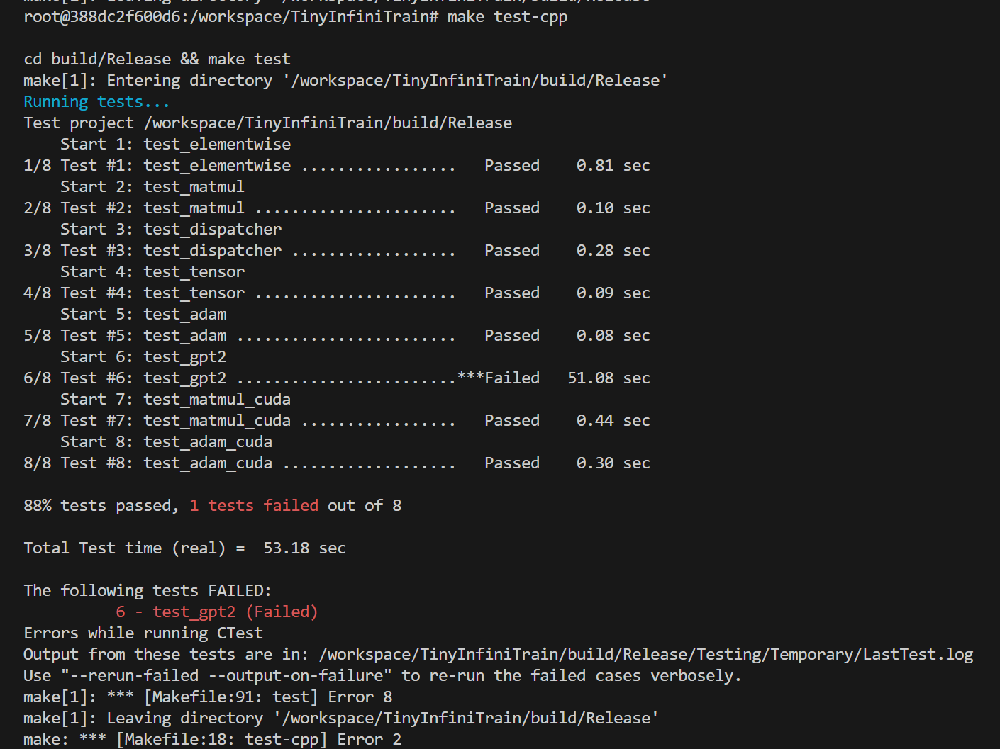

# TinyInfiniTrain 作业报告

## 一、test 通过截图



## 二、作业步骤

> 将代码填入下面代码块中指定位置，并详细描述完成该作业的解决思路和遇到的问题。

### 作业一：autograd机制调用Neg kernel的实现

难度：⭐

对应测例：`TEST(ElementwiseTest, NegForward)`，`TEST(ElementwiseTest, NegBackward)`

需要实现的代码块位置：`infini_train/src/autograd/elementwise.cc`

```c++
std::vector<std::shared_ptr<Tensor>> Neg::Forward(const std::vector<std::shared_ptr<Tensor>> &input_tensors) {
    // =================================== 作业 ===================================
    // TODO：通过Dispatcher获取设备专属kernel，对输入张量进行取反操作
    // HINT: 依赖test_dispatcher，kernel实现已给出
    // =================================== 作业 ===================================
    //确保取反模块只有一个Tensor输入
    CHECK_EQ(input_tensors.size(),1);
    //获取输入数据
    const auto &input = input_tensors[0];
    //获取当前计算设备
    auto device = input->GetDevice().Type();
    //获取当前算子的kernel
    auto kernel = Dispatcher::Instance().GetKernel({device,"NegForward"});
    return {kernel.Call<std::shared_ptr<Tensor>>(input)};
}

std::vector<std::shared_ptr<Tensor>> Neg::Backward(const std::vector<std::shared_ptr<Tensor>> &grad_outputs) {
    // =================================== 作业 ===================================
    // TODO：通过Dispatcher获取设备专属的反向传播kernel，计算梯度
    // HINT: 依赖test_dispatcher，kernel实现已给出
    // =================================== 作业 ===================================
    CHECK_EQ(grad_outputs.size(), 1);
    const auto &grad_output = grad_outputs[0];
    
    auto device = grad_output->GetDevice().Type();
    auto kernel = Dispatcher::Instance().GetKernel({device, "NegBackward"});
    return {kernel.Call<std::shared_ptr<Tensor>>(grad_output)};
}
```

#### 解决思路

NEG算子的功能是逐元素取反，f(x)=-x,

TinyInfiniTrain 的架构中由Dispatcher去进行调度，

首先断言去确定输入是符合预期的形式，然后通过自定义的Tensor类去获取输入数据的不可变指针，然后通过调度器去索引算子的前向传播函数，运算后返回值

在反向传播中，f(x)=-x求导之后固定为-1，和输入x没有关系，也就是不需要保存输入，梯度的链式传播的时候只需要对接受的梯度取反，再返回就好了

#### 遇到问题

不清楚TinyInfiniTrain 的整体架构，不知道该如何处理，大概浏览工程的代码，有了大概了解，Tensor定义数据格式以及各种工具，Dispatcher负责注册和索引算子；

需要完成Dispatcher中自动注册算子的宏定义，我一开始不熟悉宏函数的实现；

一开始没有理解自动反向传播的机理，不理解NEG算子没有实现SetupContext，后来了解之后发现是没有必要的；

### 作业二：实现矩阵乘法

难度：⭐⭐

#### CPU实现

对应测例：`TEST(MatmulTest, BasicMatrixMultiply)`，`TEST(MatmulTest, BatchedMatrixMultiply)`, `TEST(MatmulTest, BackwardPass)`

需要实现的代码块位置：`infini_train/src/kernels/cpu/linear.cc`

```c++
namespace infini_train::kernels::cpu {
std::shared_ptr<Tensor> MatmulForward(const std::shared_ptr<Tensor> &input, const std::shared_ptr<Tensor> &other) {
    // =================================== 作业 ===================================
    // TODO：实现CPU上的矩阵乘法前向计算
    // REF:
    // =================================== 作业 ===================================
    const auto &input_dims = input->Dims();
    const auto &other_dims = other->Dims();
    
    // 基础维度校验
    CHECK_GE(input_dims.size(), 2);
    CHECK_GE(other_dims.size(), 2);
    
    // 提取矩阵维度
    const int64_t M = input_dims[input_dims.size() - 2];
    const int64_t K = input_dims[input_dims.size() - 1];
    const int64_t N = other_dims[other_dims.size() - 1];
    CHECK_EQ(K, other_dims[other_dims.size() - 2]);  // 维度匹配检查

    // 计算Batch Size
    int64_t batch_size = 1;
    for (size_t i = 0; i < input_dims.size() - 2; ++i) {
        batch_size *= input_dims[i];
    }
    
    // 检查两个输入的batch维度是否一致
    int64_t other_batch_size = 1;
    for (size_t i = 0; i < other_dims.size() - 2; ++i) {
        other_batch_size *= other_dims[i];
    }
    CHECK_EQ(batch_size, other_batch_size) << "MatmulForward requires same batch size for both inputs";

    // 创建输出Tensor
    auto output_dims = input_dims;
    output_dims[output_dims.size() - 1] = N;
    auto output = std::make_shared<Tensor>(output_dims, DataType::kFLOAT32);

    // 获取数据指针
    float *a = (float *)input->DataPtr();
    float *b = (float *)other->DataPtr();
    float *c = (float *)output->DataPtr();

    // 计算每个矩阵的大小
    const int64_t A_stride = M * K;
    const int64_t B_stride = K * N;
    const int64_t C_stride = M * N;

    // 按照每个batch计算矩阵乘法
    for (int64_t b_idx = 0; b_idx < batch_size; ++b_idx) {
        // 计算当前batch的指针偏移
        float *a_ptr = a + b_idx * A_stride;
        float *b_ptr = b + b_idx * B_stride;
        float *c_ptr = c + b_idx * C_stride;

        // 使用Eigen进行矩阵乘法计算
        Eigen::Map<Eigen::Matrix<float, Eigen::Dynamic, Eigen::Dynamic, Eigen::RowMajor>> 
            Am(a_ptr, M, K);
        Eigen::Map<Eigen::Matrix<float, Eigen::Dynamic, Eigen::Dynamic, Eigen::RowMajor>> 
            Bm(b_ptr, K, N);
        Eigen::Map<Eigen::Matrix<float, Eigen::Dynamic, Eigen::Dynamic, Eigen::RowMajor>> 
            Cm(c_ptr, M, N);

        // 执行矩阵乘法：C = A * B
        Cm.noalias() = Am * Bm;
    }

    return output;
}

std::tuple<std::shared_ptr<Tensor>, std::shared_ptr<Tensor>>
MatmulBackward(const std::shared_ptr<Tensor> &input, const std::shared_ptr<Tensor> &other,
               const std::shared_ptr<Tensor> &grad_output) {
    // =================================== 作业 ===================================
    // TODO：实现CPU上的矩阵乘法反向传播
    // REF:
    // =================================== 作业 ===================================
    // 维度检查
    const auto &in_dims = input->Dims();
    const auto &ot_dims = other->Dims();
    const auto &go_dims = grad_output->Dims();
    
    CHECK_GE(in_dims.size(), 2);
    CHECK_GE(ot_dims.size(), 2);
    CHECK_GE(go_dims.size(), 2);

    // 提取矩阵维度
    const int64_t M = in_dims[in_dims.size() - 2];
    const int64_t K = in_dims[in_dims.size() - 1];
    const int64_t N = ot_dims[ot_dims.size() - 1];
    
    // 维度匹配检查
    CHECK_EQ(K, ot_dims[ot_dims.size() - 2]);
    CHECK_EQ(go_dims[go_dims.size() - 2], M);
    CHECK_EQ(go_dims[go_dims.size() - 1], N);

    // 计算Batch Size
    int64_t batch_size = 1;
    for (size_t i = 0; i < in_dims.size() - 2; ++i) {
        batch_size *= in_dims[i];
    }
    
    // 检查所有输入的batch维度是否一致
    int64_t other_batch_size = 1;
    for (size_t i = 0; i < ot_dims.size() - 2; ++i) {
        other_batch_size *= ot_dims[i];
    }
    int64_t grad_batch_size = 1;
    for (size_t i = 0; i < go_dims.size() - 2; ++i) {
        grad_batch_size *= go_dims[i];
    }
    
    CHECK_EQ(batch_size, other_batch_size) << "MatmulBackward requires same batch size for input and other";
    CHECK_EQ(batch_size, grad_batch_size) << "MatmulBackward requires same batch size for grad_output";

    // 创建梯度张量
    auto grad_input = std::make_shared<Tensor>(in_dims, DataType::kFLOAT32);
    auto grad_other = std::make_shared<Tensor>(ot_dims, DataType::kFLOAT32);

    // 获取数据指针
    float *a  = (float *)input->DataPtr();
    float *b  = (float *)other->DataPtr();
    float *go = (float *)grad_output->DataPtr();
    float *gi = (float *)grad_input->DataPtr();
    float *gb = (float *)grad_other->DataPtr();

    // 计算每个矩阵的大小
    const int64_t A_stride = M * K;
    const int64_t B_stride = K * N;
    const int64_t C_stride = M * N;

    // 初始化梯度为0
    std::memset(gi, 0, sizeof(float) * batch_size * A_stride);
    std::memset(gb, 0, sizeof(float) * batch_size * B_stride);

    // 逐batch计算梯度
    for (int64_t b_idx = 0; b_idx < batch_size; ++b_idx) {
        // 计算当前batch的指针偏移
        float *a_ptr  = a  + b_idx * A_stride;
        float *b_ptr  = b  + b_idx * B_stride;
        float *go_ptr = go + b_idx * C_stride;
        float *gi_ptr = gi + b_idx * A_stride;
        float *gb_ptr = gb + b_idx * B_stride;

        // 将数据映射为Eigen矩阵
        Eigen::Map<Eigen::Matrix<float, Eigen::Dynamic, Eigen::Dynamic, Eigen::RowMajor>> 
            Am(a_ptr, M, K);
        Eigen::Map<Eigen::Matrix<float, Eigen::Dynamic, Eigen::Dynamic, Eigen::RowMajor>> 
            Bm(b_ptr, K, N);
        Eigen::Map<Eigen::Matrix<float, Eigen::Dynamic, Eigen::Dynamic, Eigen::RowMajor>> 
            GOm(go_ptr, M, N);
        Eigen::Map<Eigen::Matrix<float, Eigen::Dynamic, Eigen::Dynamic, Eigen::RowMajor>> 
            GIm(gi_ptr, M, K);
        Eigen::Map<Eigen::Matrix<float, Eigen::Dynamic, Eigen::Dynamic, Eigen::RowMajor>> 
            GBm(gb_ptr, K, N);
        // grad_input = grad_output * other^T
        // grad_other = input^T * grad_output
        GIm.noalias() += GOm * Bm.transpose();
        GBm.noalias() += Am.transpose() * GOm;
    }

    return {grad_input, grad_other};
}
```

#### CUDA实现

对应测例：`TEST(MatmulTest, BasicMatrixMultiplyCuda)`,`TEST(MatmulTest, BatchedMatrixMultiplyCuda)`,`TEST(MatmulTest, BackwardPassCuda)`

需要实现的代码块位置：`infini_train/src/kernels/cuda/linear.cu`

```c++
std::shared_ptr<Tensor> MatmulForward(const std::shared_ptr<Tensor> &input, const std::shared_ptr<Tensor> &other) {
    // =================================== 作业 ===================================
    // TODO：实现CUDA上的矩阵乘法前向计算
    // REF:
    // =================================== 作业 ===================================
    //获取输入张量维度
    const auto& input_dims = input->Dims();
    const auto& other_dims = other->Dims();

    //基础维度校验
    CHECK_GE(input_dims.size(), 2);
    CHECK_GE(other_dims.size(), 2);
    int64_t M = input_dims[input_dims.size() - 2];
    int64_t K = input_dims[input_dims.size() - 1];
    int64_t N = other_dims[other_dims.size() - 1];
    CHECK_EQ(K, other_dims[other_dims.size() - 2]);

    //计算Batch Size
    int64_t batch_size = 1;
    for (size_t i = 0; i < input_dims.size() - 2; ++i) {
        batch_size *= input_dims[i];
    }

    //创建输出 Tensor
    auto output_dims = input_dims;
    output_dims[output_dims.size() - 1] = N;
    auto output = std::make_shared<Tensor>(output_dims, DataType::kFLOAT32, input->GetDevice());

    //创建句柄被正确创建
    static cublasHandle_t handle = nullptr;
    if (handle == nullptr) {
        CUBLAS_CHECK(cublasCreate(&handle));
    }

    //调用cublasSgemm计算
    const float alpha = 1.0f;
    const float beta  = 0.0f;
    int64_t A_stride = M * K;
    int64_t B_stride = K * N;
    int64_t C_stride = M * N;

    for (int64_t b = 0; b < batch_size; ++b) {
        const float* A_ptr = static_cast<const float*>(input->DataPtr()) + b * A_stride;
        const float* B_ptr = static_cast<const float*>(other->DataPtr()) + b * B_stride;
        float* C_ptr = static_cast<float*>(output->DataPtr()) + b * C_stride;
        // C = A * B  =>  C.T = B.T * A.T
        CUBLAS_CHECK(cublasSgemm(handle, CUBLAS_OP_N, CUBLAS_OP_N, 
                                 N, M, K, 
                                 &alpha, B_ptr, N, A_ptr, K, 
                                 &beta, C_ptr, N));
    }

    return output;
}
std::tuple<std::shared_ptr<Tensor>, std::shared_ptr<Tensor>>
MatmulBackward(const std::shared_ptr<Tensor> &input, const std::shared_ptr<Tensor> &other,
               const std::shared_ptr<Tensor> &grad_output) {
    // =================================== 作业 ===================================
    // TODO：实现CUDA上的矩阵乘法反向传播
    // REF:
    // =================================== 作业 ===================================

    const auto& in_dims = input->Dims();
    const auto& ot_dims = other->Dims();
    
    int64_t M = in_dims[in_dims.size() - 2];
    int64_t K = in_dims[in_dims.size() - 1];
    int64_t N = ot_dims[ot_dims.size() - 1];

    // 计算 Batch Size
    int64_t batch_size = 1;
    for (size_t i = 0; i < in_dims.size() - 2; ++i) {
        batch_size *= in_dims[i];
    }

    auto grad_input = std::make_shared<Tensor>(in_dims, DataType::kFLOAT32, grad_output->GetDevice());
    auto grad_other = std::make_shared<Tensor>(ot_dims, DataType::kFLOAT32, grad_output->GetDevice());

    static cublasHandle_t handle = nullptr;
    if (handle == nullptr) {
        CUBLAS_CHECK(cublasCreate(&handle));
    }

    //调用cublasSgemm计算
    const float alpha = 1.0f;
    const float beta  = 0.0f;

    int64_t A_stride = M * K;
    int64_t B_stride = K * N;
    int64_t C_stride = M * N;

    for (int64_t b = 0; b < batch_size; ++b) {
        const float* A = static_cast<const float*>(input->DataPtr()) + b * A_stride;
        const float* B = static_cast<const float*>(other->DataPtr()) + b * B_stride;
        const float* dC = static_cast<const float*>(grad_output->DataPtr()) + b * C_stride;
        float* dA = static_cast<float*>(grad_input->DataPtr()) + b * A_stride;
        float* dB = static_cast<float*>(grad_other->DataPtr()) + b * B_stride;

        CUBLAS_CHECK(cublasSgemm(handle, 
                                 CUBLAS_OP_T, CUBLAS_OP_N, 
                                 K, M, N, 
                                 &alpha, 
                                 B, N,     
                                 dC, N,    
                                 &beta, 
                                 dA, K));  

        CUBLAS_CHECK(cublasSgemm(handle, 
                                 CUBLAS_OP_N, CUBLAS_OP_T, 
                                 N, K, M, 
                                 &alpha, 
                                 dC, N,    
                                 A, K,     
                                 &beta, 
                                 dB, N));  
    }

    return {grad_input, grad_other};
}
```

#### 解决思路

为了适应高维度的矩阵乘法，把3维及以上的维度全部展开为batch，之后GPU去调用culab的通用矩阵乘法运算，CPU则通过tensor中转化为Eilgen的数据结构，进行矩阵乘法和转置，通过for循环去实现batch；

矩阵乘法的反向传播公式：
$$
\frac{\partial L}{\partial A} = \frac{\partial L}{\partial Y} \times B^T
$$

$$
\frac{\partial L}{\partial B} = A^T \times \frac{\partial L}{\partial Y}
$$

#### 遇到问题

一开始手动分析维度，去进行拆分运算，不清楚高维度的矩阵如何进行运算，后面了解到矩阵展开后，可以合并为统一的代码；

culab中的通用矩阵乘法默认的是列主序，而我保存的数据默认是行主序；

### 作业三：实现Adam优化器

难度：⭐

#### CPU实现

对应测例：`TEST(AdamOptimizerTest, BasicParameterUpdate)`,`TEST(AdamOptimizerTest, MomentumAccumulation)`

代码位置：infini_train/src/kernels/cpu/accumulate_grad.cc

```c++
void AdamAccumulateGrad(const std::shared_ptr<Tensor> &grad, const std::shared_ptr<Tensor> &param,
                        const std::shared_ptr<Tensor> &m, const std::shared_ptr<Tensor> &v, float learning_rate,
                        float beta1, float beta2, float eps, int64_t t) {
    // =================================== 作业 ===================================
    // TODO：实现Adam优化器的梯度累积和参数更新
    // REF:
    // =================================== 作业 ===================================
    // 获取元素个数
    size_t n = param->NumElements();
    
    // 获取数据指针
    float* grad_data = static_cast<float*>(grad->DataPtr());
    float* param_data = static_cast<float*>(param->DataPtr());
    float* m_data = static_cast<float*>(m->DataPtr());
    float* v_data = static_cast<float*>(v->DataPtr());
    
    // 预计算偏差校正
    float beta1_pow_t = std::pow(beta1, t);
    float beta2_pow_t = std::pow(beta2, t);
    float inv_bias_correction1 = 1.0f / (1.0f - beta1_pow_t);
    float inv_bias_correction2 = 1.0f / (1.0f - beta2_pow_t);
    
    // 循环更新每个元素
    for (size_t i = 0; i < n; ++i) {
        float gi = grad_data[i];
        
        // 更新一阶矩（动量）
        m_data[i] = beta1 * m_data[i] + (1.0f - beta1) * gi;
        
        // 更新二阶矩（更新波动）
        v_data[i] = beta2 * v_data[i] + (1.0f - beta2) * gi * gi;
        
        // 偏差校正后的估计
        float m_hat = m_data[i] * inv_bias_correction1;
        float v_hat = v_data[i] * inv_bias_correction2;
        
        // 更新参数
        param_data[i] -= learning_rate * m_hat / (std::sqrt(v_hat) + eps);
    }
}
```

#### CUDA实现

对应测例：`TEST(AdamOptimizerTest, BasicParameterUpdateCuda)`,`TEST(AdamOptimizerTest, MomentumAccumulationCuda)`

代码位置：infini_train/src/kernels/cuda/accumulate_grad.cu

```c++
__global__ void adam_update_kernel(
    const float* __restrict__ grad,
    float* __restrict__ param,
    float* __restrict__ m,
    float* __restrict__ v,
    size_t n,
    float learning_rate,
    float beta1,
    float beta2,
    float eps,
    float inv_bias_correction1,
    float inv_bias_correction2) {
    
    // 计算线程索引
    size_t idx = blockIdx.x * blockDim.x + threadIdx.x;
    
    // 如果索引有效，处理对应的元素
    if (idx < n) {
        float g = grad[idx];
        
        // 更新一阶矩
        float m_val = m[idx];
        m_val = beta1 * m_val + (1.0f - beta1) * g;
        m[idx] = m_val;
        
        // 更新二阶矩
        float v_val = v[idx];
        v_val = beta2 * v_val + (1.0f - beta2) * g * g;
        v[idx] = v_val;
        
        // 计算偏差校正后的估计
        float m_hat = m_val * inv_bias_correction1;
        float v_hat = v_val * inv_bias_correction2;
        
        // 更新参数
        param[idx] -= learning_rate * m_hat / (sqrtf(v_hat) + eps);
    }
}

void AdamAccumulateGrad(const std::shared_ptr<Tensor> &grad, const std::shared_ptr<Tensor> &param,
                        const std::shared_ptr<Tensor> &m, const std::shared_ptr<Tensor> &v, float learning_rate,
                        float beta1, float beta2, float eps, int64_t t) {
    // =================================== 作业 ===================================
    // TODO：实现Adam优化器的梯度累积和参数更新
    // REF:
    // =================================== 作业 ===================================
    // 获取CUDA设备信息
    auto device = param->GetDevice();
    if (device.Type() != DeviceType::kCUDA) {
        throw std::runtime_error("This Adam CUDA kernel requires CUDA device");
    }
    
    // 获取数据指针
    float* grad_data = static_cast<float*>(grad->DataPtr());
    float* param_data = static_cast<float*>(param->DataPtr());
    float* m_data = static_cast<float*>(m->DataPtr());
    float* v_data = static_cast<float*>(v->DataPtr());
    
    // 获取元素数量
    size_t n = param->NumElements();
    
    // 设置线程块和网格大小
    int blockSize = 256;
    int gridSize = (n + blockSize - 1) / blockSize;
    
    // 预计算偏差校正系数
    float beta1_pow_t = powf(beta1, static_cast<float>(t));
    float beta2_pow_t = powf(beta2, static_cast<float>(t));
    float inv_bias_correction1 = 1.0f / (1.0f - beta1_pow_t);
    float inv_bias_correction2 = 1.0f / (1.0f - beta2_pow_t);
    
    // 启动CUDA kernel
    adam_update_kernel<<<gridSize, blockSize>>>(
        grad_data, param_data, m_data, v_data,
        n, learning_rate, beta1, beta2, eps,
        inv_bias_correction1, inv_bias_correction2
    );
    
    // 检查CUDA错误
    cudaError_t err = cudaGetLastError();
    if (err != cudaSuccess) {
        throw std::runtime_error("CUDA kernel failed: " + std::string(cudaGetErrorString(err)));
    }
}
```

#### 解决思路

adam优化器是引入了动量以及自适应调整学习率，防止陷入局部最优和防止震荡加速收敛来更好的更新参数，为了消除初始化为零导致的早期偏差，引入偏差校正；每一次更新中遍历所有的元素，单独更新动量和调整因子，并更新权重

#### 遇到问题

一开始看资料不理解一阶矩而二阶矩，后来了解知道，一阶矩表示了期望，二阶矩反应了方差，期望表示最近几次更新的方向，方差表示梯度的稳定性；

偏差校正系数可以修正的原因是，一般初始化的时候如果为0或者接近0，会导致更新的梯度太小，影响效率，这个修正因子再0附近较大可以加速更新，原理0的时候又接近于1，不影响更新

### 作业四：实现Tensor基础操作

#### 实现Tensor的Flatten操作

难度：⭐

对应测例：`TEST(TensorTransformTest, Flatten2DTo1D)`,`TEST(TensorTransformTest, FlattenWithRange) `,`TEST(TensorTransformTest, FlattenNonContiguous)`

代码位置：infini_train/src/tensor.cc

```c++
std::shared_ptr<Tensor> Tensor::Flatten(int64_t start, int64_t end) {
    // return Contiguous()->View(new_shape);
    // =================================== 作业 ===================================
    // TODO：实现张量扁平化操作，将指定维度范围[start, end]内的所有维度合并为一个维度
    // HINT:
    // =================================== 作业 ===================================
    //获取连续的张量
    auto contiguous_tensor = this->Contiguous();
    
    //获取原始形状
    auto original_shape = contiguous_tensor->Dims();
    int64_t ndim = original_shape.size();
    
    //处理负索引
    if (start < 0) start += ndim;
    if (end < 0) end += ndim;
    
    //计算新形状
    std::vector<int64_t> new_shape;
    
    // 添加 start 之前的维度
    for (int64_t i = 0; i < start; ++i) {
        new_shape.push_back(original_shape[i]);
    }
    
    // 合并 [start, end] 维度
    int64_t flattened_size = 1;
    for (int64_t i = start; i <= end; ++i) {
        flattened_size *= original_shape[i];
    }
    new_shape.push_back(flattened_size);
    
    // 添加 end 之后的维度
    for (int64_t i = end + 1; i < ndim; ++i) {
        new_shape.push_back(original_shape[i]);
    }
    
    //调用 View 创建新张量
    return contiguous_tensor->View(new_shape);
}

```

#### 实现Tensor的反向传播机制

难度：⭐

对应测例：`TEST(TensorAutogradTest, BackwardComputesGradient)`,`TEST(TensorAutogradTest, BackwardWithMultipleOutputs)`

代码位置：infini_train/src/tensor.cc

```c++
void Tensor::Backward(std::shared_ptr<Tensor> gradient, bool retain_graph, bool create_graph)  {
    // =================================== 作业 ===================================
    // TODO：实现自动微分反向传播
    // 功能描述：1. 计算当前张量对叶子节点的梯度    2. 支持多输出场景的梯度累加
    // =================================== 作业 ===================================
    //判断是否需要梯度
    if (!requires_grad_) {
        return;
    }
    
    // 处理初始梯度
    if (!gradient) {
        gradient = std::make_shared<Tensor>(std::vector<int64_t>{}, DataType::kFLOAT32);
        gradient->Fill(1.0f);
    }
    
    // 如果是叶子节点，直接累积
    if (is_leaf_) {
        if (!grad_) {
            grad_ = gradient;
        } else {
            grad_ = grad_->Add(gradient);
        }
        return;
    }
    
    // 非叶子节点
    if (grad_fn_) {
        grad_fn_->BackwardPartial(gradient, output_idx_);
    }
}
```

#### 解决思路

tensor的展平，通过累乘计算新的维度大小，通过调用View函数，传入计算好的维度，完成展平；

tensor的反向传播，首先判断该层需不需要反向传播，其次如果是叶子节点就要累加当前梯度，因为一个数据可能同时传给多个层，要同时考虑多个反向传播的结果，如果不是叶子节点就要继续进行反向传播；

#### 遇到问题

反向传播我需要更新tensor的grad_，但是题目这个函数给我的const标签，让我没有办法去更新梯度，不清楚还有什么方法可以解决就暂时删除了const标签；

### 作业五 注册算子kernel的实现

难度：⭐⭐⭐

对应测例：`TEST(DispatcherTest, RegisterAndGetKernel)`,`TEST(DispatcherTest, DuplicateRegistration)`,`TEST(DispatcherTest, GetNonexistentKernel)`

代码位置：infini_train/include/dispatcher.h

```c++
	template <typename RetT, class... ArgsT> RetT Call(ArgsT... args) const {
        // =================================== 作业 ===================================
        // TODO：实现通用kernel调用接口
        // 功能描述：将存储的函数指针转换为指定类型并调用
        // =================================== 作业 ===================================

        using FuncT = RetT (*)(ArgsT...);
        // TODO: 实现函数调用逻辑
        FuncT func = reinterpret_cast<FuncT>(func_ptr_);
        return func(std::forward<ArgsT>(args)...);
    }


    template <typename FuncT> void Register(const KeyT &key, FuncT &&kernel) {
        // =================================== 作业 ===================================
        // TODO：实现kernel注册机制
        // 功能描述：将kernel函数与设备类型、名称绑定
        // =================================== 作业 ===================================
        if (key_to_kernel_map_.find(key) != key_to_kernel_map_.end()) {
            LOG(FATAL) << "Kernel " << key.second 
                      << " already registered for device " 
                      << static_cast<int>(key.first);
        }
    
        key_to_kernel_map_.emplace(key,KernelFunction(std::forward<FuncT>(kernel)));
    }

    // =================================== 作业 ===================================
    // TODO：实现自动注册宏
    // 功能描述：在全局静态区注册kernel，避免显式初始化代码
    // =================================== 作业 ===================================
    #define REGISTER_KERNEL(device, kernel_name, kernel_func)                 \
        static bool _kernel_registered_##kernel_name = []() {                \
            infini_train::Dispatcher::Instance().Register(                   \
                infini_train::Dispatcher::KeyT{                              \
                    device, std::string(#kernel_name)                        \
                },                                                           \
                kernel_func                                                   \
            );                                                               \
            return true;                                                     \
        }();

```

#### 解决思路

kernel调用接口就是根据注册的映射关系，去返回保存的函数指针；

kernel注册是通过保存kernel函数，{设备，名称}的键值对，同时要检查该kernel是否 已经注册完成了；

自动注册的宏，通过宏函数，并且static标签，使得每一个算子在开始的时候就提前注册好，方便注册和调用；

#### 遇到问题

在实现宏的时候，发现如果把注释放在宏中间会出现问题，宏后面没有换行也会触发警告；

### 作业六：实现GPT-2整体训练

难度：⭐⭐⭐⭐

对应测例：`TEST_F(GPT2TrainingTest, LogitsConsistency)`

#### 训练过程logits对比

完成以上所有作业，补齐训练框架的所有实现，理论上`TEST_F(GPT2TrainingTest, LogitsConsistency)`可以通过，在用例中判断比较预置的值和单步正向传播计算结果是否在误差允许范围内相等。

#### 数据读取实现

代码位置：example/common/tiny_shakespeare_dataset.cc

```c++
TinyShakespeareFile ReadTinyShakespeareFile(const std::string &path, size_t sequence_length) {
    /* =================================== 作业 ===================================
       TODO：实现二进制数据集文件解析
       文件格式说明：
    ----------------------------------------------------------------------------------
    | HEADER (1024 bytes)                     | DATA (tokens)                        |
    | magic(4B) | version(4B) | num_toks(4B) | reserved(1012B) | token数据           |
    ----------------------------------------------------------------------------------
       =================================== 作业 =================================== */
    // 1. 打开文件
    std::ifstream ifs(path, std::ios::binary);
    if (!ifs.is_open()) {
        LOG(FATAL) << "Cannot open dataset file: " << path;
    }
    
    // 2. 读取头部信息（1024字节）
    std::vector<uint8_t> header_bytes = ReadSeveralBytesFromIfstream(1024, &ifs);
    
    // 3. 解析头部信息
    uint32_t magic_number = BytesToType<uint32_t>(header_bytes, 0);
    uint32_t version = BytesToType<uint32_t>(header_bytes, 4);
    uint32_t num_tokens = BytesToType<uint32_t>(header_bytes, 8);
    
    // 4. 根据magic_number确定数据类型
    auto type_it = kTypeMap.find(magic_number);
    if (type_it == kTypeMap.end()) {
        LOG(FATAL) << "Unknown magic number: " << magic_number;
    }
    TinyShakespeareType data_type = type_it->second;
    
    // 5. 获取数据类型大小和对应的DataType
    size_t type_size = kTypeToSize.at(data_type);
    DataType tensor_data_type = kTypeToDataType.at(data_type);
    
    // 6. 计算需要读取的数据字节数
    size_t data_size_bytes = num_tokens * type_size;
    
    // 7. 读取token数据
    std::vector<uint8_t> data_bytes = ReadSeveralBytesFromIfstream(data_size_bytes, &ifs);
    
    // 8. 创建Tensor
    // 数据形状为 [num_tokens]
    std::vector<int64_t> tensor_dims = {static_cast<int64_t>(num_tokens)};
    
    // 创建Tensor对象（不是shared_ptr）
    infini_train::Tensor tensor(tensor_dims, DataType::kINT64);
    
    // 获取Tensor的buffer
    int64_t* tensor_data = static_cast<int64_t*>(tensor.DataPtr());
    
    // 根据原始数据类型复制和转换数据
    if (data_type == TinyShakespeareType::kUINT16) {
        // 将uint16数据转换为int64
        uint16_t* src_data = reinterpret_cast<uint16_t*>(data_bytes.data());
        for (size_t i = 0; i < num_tokens; i++) {
            tensor_data[i] = static_cast<int64_t>(src_data[i]);
        }
    } else if (data_type == TinyShakespeareType::kUINT32) {
        // 将uint32数据转换为int64
        uint32_t* src_data = reinterpret_cast<uint32_t*>(data_bytes.data());
        for (size_t i = 0; i < num_tokens; i++) {
            tensor_data[i] = static_cast<int64_t>(src_data[i]);
        }
    }
    // 9. 创建并返回TinyShakespeareFile结构体
    TinyShakespeareFile result;
    result.type = data_type;
    result.dims = tensor_dims;
    result.tensor = std::move(tensor);  // 使用移动语义
    
    return result;
}

TinyShakespeareDataset::TinyShakespeareDataset(const std::string &filepath, size_t sequence_length) {
    // =================================== 作业 ===================================
    // TODO：初始化数据集实例
    // HINT: 调用ReadTinyShakespeareFile加载数据文件
    // =================================== 作业 ===================================
    // 1. 读取数据集文件
    text_file_ = ReadTinyShakespeareFile(filepath, sequence_length);
    
    // 2. 获取数据类型大小
    size_t type_size = kTypeToSize.at(text_file_.type);
    
    // 3. 计算sequence的字节大小（不能在初始化列表后修改常量成员）
    // 我们需要通过const_cast修改，但更好的方式是在初始化列表中计算
    // 这里我们重新设计：sequence_size_in_bytes_应该是非常量成员
    
    // 4. 获取总token数
    uint32_t num_tokens = text_file_.dims[0];
    
    // 5. 计算样本数量
    const_cast<size_t&>(sequence_size_in_bytes_) = sequence_length * type_size * 2;
    const_cast<size_t&>(num_samples_) = (num_tokens - 1) / sequence_length;
    
    // 6. 验证数据是否足够
    if (num_samples_ == 0) {
        LOG(FATAL) << "Dataset too small for sequence length " << sequence_length 
                   << ". Need at least " << (sequence_length + 1) << " tokens.";
    }
}
```

#### Tokenizer功能实现

代码位置：example/common/tokenizer.cc

```c++
Tokenizer::Tokenizer(const std::string &filepath) {
    /* ===================================== 作业 =====================================
    TODO：实现Tokenizer二进制文件加载

    文件格式说明：
    ----------------------------------------------------------------------------------
    | HEADER (1024 bytes)                     | VOCAB TABLE                           |
    | magic(4B) | version(4B) | vocab_size(4B) | reserved(1012B) | token词表数据       |
    ----------------------------------------------------------------------------------
    ===================================== 作业 ===================================== */
    std::ifstream ifs(filepath, std::ios::binary);
    std::vector<uint8_t> header_bytes = ReadSeveralBytesFromIfstream(1024,&ifs);
    magic_number_ = BytesToType<uint32_t>(header_bytes,0);
    uint32_t version_data = BytesToType<uint32_t>(header_bytes,4);
    vocab_size_ = BytesToType<uint32_t>(header_bytes,8);

    auto it = kEotMap.find(magic_number_);
    eot_token_ = it->second;

    token_table_.reserve(vocab_size_);
    for(int i = 0; i < vocab_size_;i++){
        //读取当前token字节长度
        uint8_t token_len = 0;
        ifs.read(reinterpret_cast<char *>(&token_len), 1);
        std::vector<uint8_t> token_bytes = ReadSeveralBytesFromIfstream(token_len,&ifs);
        std::string token(token_bytes.begin(), token_bytes.end());

        token_table_.push_back(token);
    }
}
std::string Tokenizer::Decode(uint32_t token_id) const {
    /* ===================================== 作业 =====================================
    TODO：实现token_id到文本的转换
    功能描述：根据token_id返回对应的文本片段
    ===================================== 作业 ===================================== */
        return token_table_[token_id];
}
void Tokenizer::GenerateText(infini_train::nn::Module &model, uint32_t batch_size, uint32_t sequence_length,
                             uint32_t text_length, Device device) const {
    LOG(INFO) << "start generate text:";
    for (int t = prompt_len; t < text_length; t++) {
        /* ===================================== 作业 =====================================
        TODO：实现单步文本生成逻辑
        HINT：调用model.Forward推理获取logits，根据推理结果进行随机采样，调用Decode获取文本结果
        ===================================== 作业 ===================================== */
    }
        std::vector<std::shared_ptr<infini_train::Tensor>> result = model.Forward({x});
        auto logits_tensor = result[0];
        
        // 2. 获取logits形状
        auto logits_shape = logits_tensor->Dims();
        int64_t vocab_size = logits_shape[2];  // 从tensor获取vocab_size
        
        // 3. 准备概率数组
        std::vector<float> probabilities(vocab_size);
        
        // 4. 处理每个batch
        for (int b = 0; b < batch_size; b++) {
            // 计算当前batch最后一个位置的logits起始偏移
            int64_t batch_offset = b * sequence_length * vocab_size;
            int64_t pos_offset = (sequence_length - 1) * vocab_size;
            int64_t start_idx = batch_offset + pos_offset;
            
            // 获取logits指针
            float* logits_ptr = static_cast<float*>(logits_tensor->DataPtr()) + start_idx;
            
            // 5. 计算softmax
            float max_logit = -std::numeric_limits<float>::max();
            for (int v = 0; v < vocab_size; v++) {
                if (logits_ptr[v] > max_logit) {
                    max_logit = logits_ptr[v];
                }
            }
            
            float sum_exp = 0.0f;
            for (int v = 0; v < vocab_size; v++) {
                float exp_val = std::exp(logits_ptr[v] - max_logit);
                probabilities[v] = exp_val;
                sum_exp += exp_val;
            }
            
            for (int v = 0; v < vocab_size; v++) {
                probabilities[v] /= sum_exp;
            }
            
            // 6. 采样下一个token
            float random_val = RandomF32(kRngState);
            int next_token_id = SampleMult(probabilities.data(), vocab_size, random_val);
            
            // 7. 更新当前batch的输入序列
            int64_t *batch_x_buff = x_buff + b * sequence_length;
            for (int i = 0; i < sequence_length - 1; i++) {
                batch_x_buff[i] = batch_x_buff[i + 1];
            }
            batch_x_buff[sequence_length - 1] = next_token_id;
            
            // 8. 输出第一个batch的token
            if (b == 0) {
                std::string next_token_text = Decode(next_token_id);
                std::cout << next_token_text;
                std::cout.flush();
            }
}
```

#### 解决思路

在数据读取部分，通过读取文件的函数，先读取头部信息，再通过偏移提取出`magic_number`、`version`和`num_tokens`参数储。将数据转化为Tensor再打包成TinyShakespeareFile返回。

在tokenizer部分，头部数据读取思路和数据读取部分相同，后续格式是长度+数据，Decode的实现就是把token_id和token相对应。

文本生成部分，从模型中读取到输出，对应的每一个token的概率分布，先通过softmax转化为概率，再通过给出的选择策略去选取输出。

#### 遇到问题

调用cuda算子的时候，一直提示句柄创建失败，没有搞清楚为什么